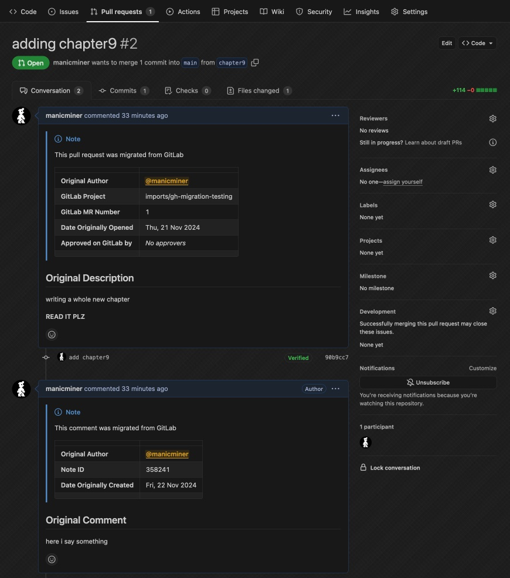
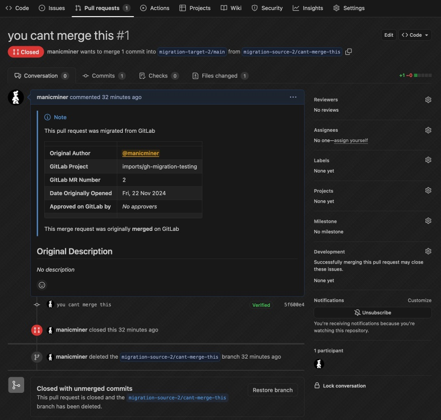

# GitLab to GitHub Repository Migration Tool (Fork)

**This is a fork of [@manicminer/gitlab-migrator](https://github.com/manicminer/gitlab-migrator) and has been heavily changed for specific use cases.**

## Key Differences from Original

This fork is specifically designed for:

1. **Single project focus**: Optimized for migrating one project at a time, with a major focus on merge request migration (the most time-consuming part)
2. **Simplified configuration**: Minimized command-line parameters, relying on environment variables for GitHub and GitLab tokens
3. **Database-driven status tracking**: Instead of relying on stdout for migration status reporting, this fork uses a database to keep track of each merge request's migration status. This provides more reliability during large-scale MR migrations
4. **Enhanced merge request handling**: Specialized optimizations for handling large volumes of merge requests efficiently

## Installing

```
go install github.com/manicminer/gitlab-migrator
```

or download the most appropriate binary for your OS & platform from the [latest release](https://github.com/manicminer/gitlab-migrator/releases/latest).

Golang 1.23 was used, you may have luck with earlier releases.

## Usage

_Example Usage_

```
gitlab-migrator -github-user=mytokenuser -gitlab-project=mygitlabuser/myproject -github-repo=mygithubuser/myrepo -migrate-pull-requests
```

**Note**: This fork has simplified the configuration approach. Most parameters are now handled through environment variables rather than command-line arguments.

Written in Go, this is a cross-platform CLI utility that accepts the following runtime arguments:

```
  -delete-existing-repos
        whether existing repositories should be deleted before migrating
  -github-domain string
        specifies the GitHub domain to use (default "github.com")
  -github-repo string
        the GitHub repository to migrate to
  -github-user string
        specifies the GitHub user to use, who will author any migrated PRs. can also be sourced from GITHUB_USER environment variable (required)
  -gitlab-domain string
        specifies the GitLab domain to use (default "gitlab.com")
  -gitlab-project string
        the GitLab project to migrate
  -loop
        continue migrating until canceled
  -max-concurrency int
        how many projects to migrate in parallel (default 4)
  -migrate-pull-requests
        whether pull requests should be migrated
  -projects-csv string
        specifies the path to a CSV file describing projects to migrate (incompatible with -gitlab-project and -github-repo)
  -rename-master-to-main
        rename master branch to main and update pull requests
```

Use the `-github-user` argument to specify the GitHub username for whom the authentication token was issued (mandatory). You can also specify this with the `GITHUB_USER` environment variable.

You can specify an individual GitLab project with the `-gitlab-project` argument, along with the target GitHub repository with the `-github-repo` argument.

Alternatively, you can supply the path to a CSV file with the `-projects-csv` argument, which should contain two columns:

```csv
gitlab-group/gitlab-project-name,github-org-or-user/github-repo-name
```

## Authentication

This tool supports two authentication methods for GitHub:

### Personal Access Token (PAT)
```bash
export GITHUB_TOKEN="ghp_your_personal_access_token"
export GITLAB_TOKEN="glpat_your_gitlab_token"  
export GITHUB_USER="your_github_username"
```

### GitHub App Authentication (Recommended for Organizations)
```bash
export GITHUB_APP_ID="123456"
export GITHUB_INSTALLATION_ID="12345678"  
export GITHUB_PRIVATE_KEY_FILE="/path/to/your/app-private-key.pem"
export GITLAB_TOKEN="glpat_your_gitlab_token"
export GITHUB_USER="your_github_username"
```

**GitHub App Benefits:**
- Higher rate limits (5,000 requests/hour vs 1,000 for PAT)
- Automatic token refresh (works for days without intervention)
- Better security and auditing
- Organization-level permissions

**This fork emphasizes environment variable configuration over command-line parameters for cleaner, more maintainable setups.**

## Database-Driven Migration Tracking

Unlike the original tool that relies on stdout for status reporting, this fork uses a database to track the migration status of each merge request. This approach provides:

- **Reliability**: Migration status persists across tool restarts
- **Progress tracking**: Detailed status of each merge request migration
- **Resume capability**: Ability to resume interrupted migrations
- **Audit trail**: Complete history of migration attempts and results

The database schema automatically handles merge request states, timestamps, and error conditions, making it ideal for large-scale migrations where tracking hundreds or thousands of merge requests is critical.

To enable migration of GitLab merge requests to GitHub pull requests (including closed/merged ones!), specify `-migrate-pull-requests`.

To delete existing GitHub repos prior to migrating, pass the `-delete-existing-repos` argument. _This is potentially dangerous, you won't be asked for confirmation._

Note: If the destination repository does not exist, this tool will attempt to create a private repository. If the destination repo already exists, it will be used unless you specify `-delete-existing-repos`

Specify the location of a self-hosted instance of GitLab with the `-gitlab-domain` argument, or a GitHub Enterprise instance with the `-github-domain` argument.

As a bonus, this tool can transparently rename the `master` branch on your GitLab repository, to `main` on the migrated GitHub repository - enable with the `-rename-master-to-main` argument.

By default, 4 workers will be spawned to migrate up to 4 projects in parallel. You can increase or decrease this with the `-max-concurrency` argument. Note that due to GitHub API rate-limiting, you may not experience any significant speed-up. See [GitHub API docs](https://docs.github.com/en/rest/using-the-rest-api/rate-limits-for-the-rest-api) for details.

Specify `-loop` to continue migrating projects until canceled. This is useful for daemonizing the migration tool, or automatically restarting when migrating a large number of projects (or a small number of very large projects).

## Logging

This tool is entirely noninteractive and outputs different levels of logs depending on your interest. You can set the `LOG_LEVEL` environment to one of `ERROR`, `WARN`, `INFO`, `DEBUG` or `TRACE` to get more or less verbosity. The default is `INFO`.

## Caching

The tool maintains a thread-safe in-memory cache for certain primitives, in order to help reduce the number of API requests being made. At this time, the following are cached the first time they are encountered, and thereafter retrieved from the cache until the tool is restarted:

- GitHub pull requests
- GitHub issue search results
- GitHub user profiles
- GitLab user profiles

## Idempotence

This tool tries to be idempotent. You can run it over and over and it will patch the GitHub repository, along with its pull requests, to match what you have in GitLab. This should help you migrate a number of projects without enacting a large maintenance window.

_Note that this tool performs a forced mirror push, so it's not recommended to run this tool after commencing work in the target repository._

For pull requests and their comments, the corresponding IDs from GitLab are added to the Markdown header, this is parsed to enable idempotence (see next section).

## Pull Requests

Whilst the git repository will be migrated verbatim, the pull requests are managed using the GitHub API and typically will be authored by the person supplying the authentication token.

Each pull request, along with every comment, will be prepended with a Markdown table showing the original author and some other metadata that is useful to know.  This is also used to map pull requests and their comments to their counterparts in GitLab and enables the tool to be idempotent.

As a bonus, if your GitLab users add the URL to their GitHub profile in the `Website` field of their GitLab profile, this tool will add a link to their GitHub profile in the markdown header of any PR or comment they originally authored.

This tool also migrates merged/closed merge requests from your GitLab projects. It does this by reconstructing temporary branches in each repo, pushing them to GitHub, creating then closing the pull request, and lastly deleting the temporary branches. Once the tool has completed, you should not have any of these temporary branches in your repo - although GitHub will not garbage collect them immediately such that you can click the `Restore branch` button in any of these PRs.

_Example migrated pull request (open)_



_Example migrated pull request (closed)_



## Contributing, reporting bugs etc...

Please use GitHub issues & pull requests. This project is licensed under the MIT license.
